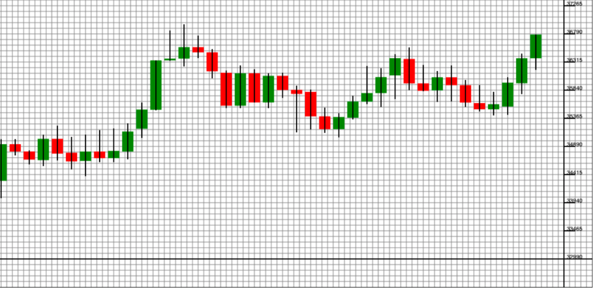

# 📊 Canvas-chart 💹

## Table Of Contents
- **[Why](#why)**
- **[How](#how)**
- **[Technologies](#technologies)**
- **[What's next](#next-steps)**
- **[Current Status](#current-status)**

#### Why
- The sole purpose of this repo is to learn canvas 2D rendering.
- Create your own chart without external libraries.
- Implement OOP model with TS.

#### How
- Some sample data from Binance API is used.
- Each Candlestick represents single timeframe prices/data per minute which can be altered.
- Each data consists of timestamp, open price, high price, low price & closing price.
- The main chart is drawn by finding the highest and lowest price ranges from the data.
- The candlesticks uses the prices open price, close price , highest price and low price to be drawn.

#### Technologies
- Vanilla js
- Webpack
- Typescript
- Canvas

#### Next Steps
- Create Timeline for x-axis with given timestamps.
- Add zoom/resize events to draw canvas.
- Use websocket to draw candlestick on real timeframe.
- Code cleanups and good naming conventions.

#### Current Status

